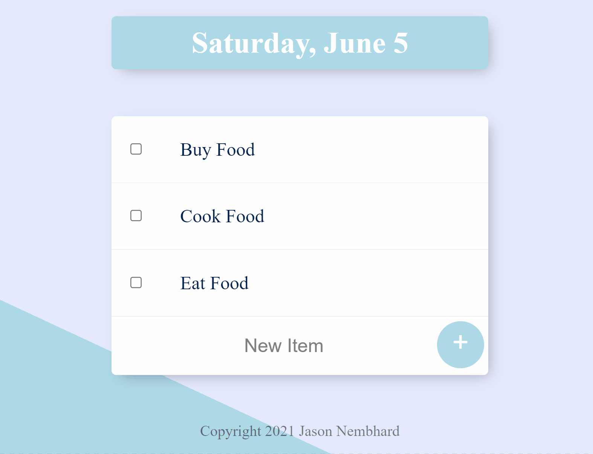
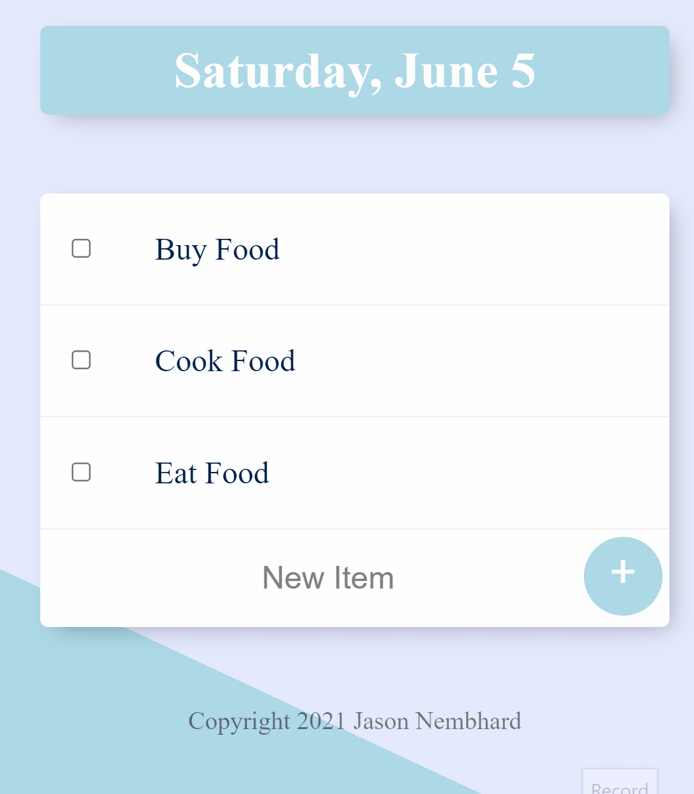

# To-Do List
This is a To-Do List application that allows users to add to a list items and cross of the item from the list when the task is complete. I have an example hosted on a webpage [HERE](https://git.heroku.com/todolist-nembhard.git).

## Setup
1. Download the latest version of node.js for your Operating System.
2. Next, download the latest version of Nodemon.
    * This can be used to auto restart the application.
3. Run npm install inside the todolist-v1 folder from the command line.
4. To run the application enter into the command line interface (CLI):
    ```
    nodemon app.js
    ```
## Display
If the application is running successfully, the CLI will display:
```bash
Server is running on port 3000
```

You can then type localhost:3000 into your browser of choice. You should see the screen below.
<p align="center"></p>

## How To Update the List
<body>
  <table>
    <tr>
      <td></td>
      <td>
        <ul>
          <li> Click on the text window where it displays "New Item." </li>
          <li> Type in what you'd like to add to the list. </li>
          <li> Press "Enter" or press the "+" sign to update the list.</li>
          <li> Click the boxes displayed next to each item to cross-off and uncross an item.</li>
        </ul>
      </td>
    </tr>
  </table>
</body>

## Roadmap
* Future updates for this application will include linking the list to a database with suggested To-Do items.
